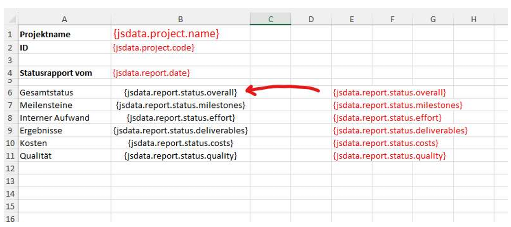
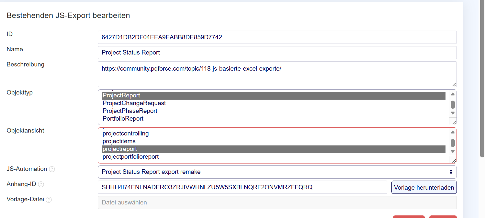
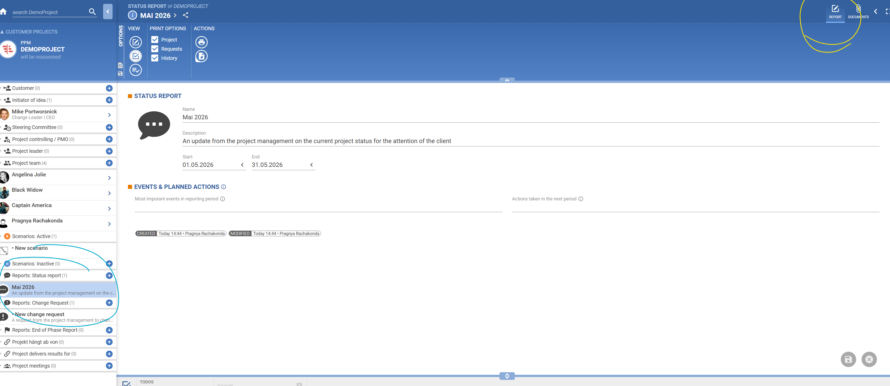

### Debugging Tip: Print the Client Object

To understand how data is structured and accessed, add this snippet to your automation:

```js
try {
    console.log('CLIENT: ' + JSON.stringify(client));
} catch(e) {
    console.log('CLIENT ERROR: ' + e);
}
```

This file explains how to build an Excel export in PQForce using a JavaScript automation.

1. You upload an Excel template that contains placeholder text.
2. You create a JS automation that builds a JSON object named jsdata.
3. During export, pqforce replaces the placeholders in the Excel template with values from jsdata, while keeping the template’s formulas and formatting. That lets you use Excel formulas, conditional formatting, icons, charts, and layouting on top of the injected data.

Important
    - Automation must have the category EXPORT to be selectable in the export config
    - The export can run in another user’s context, but the JavaScript/API access may effectively depend on the rights of the user who created the JS automation, so non-admin execution needs testing in your setup

### Example : Project Status Report 
The Excel sheet contains placeholders like {jsdata.project.name}, {jsdata.project.code}, {jsdata.report.date}, and status placeholders such as {jsdata.report.status.overall}.

The JS automation fetches a project report and project info, then constructs jsdata with nested fields:

        - project.name
        - project.code
        - report.date
        - report.status.overall
        - report.status.milestones
        - report.status.costs
        - report.status.effort
        - report.status.deliverables
        - report.status.quality

**Important:** PQForce only fills the cells with values; all visual behavior comes from the Excel file you design.

### Steps 
1. Build the Excel Template 
- create an .xlsx file with labels and placeholders 


jsdata object would be defined in a JSON file : 

```json
{
	'project': {
		'name': ...,
		'code': ...
    },
	'report': {
    	'date': ...,
    	'status': {
        	'overall': ...,
        	'milestones': ...,
        	'costs': ...,
        	'effort': ...,
        	'deliverables': ...,
        	'quality': ...
    	}
    }
}
```

2. Create the JS Automation 
Create a JS automation that assembles a jsdata object. The post’s sample code does roughly this:

get the current report via pqf.pm.getProjectReport('ProjectReport', reference.id)
get the related project via pqf.pm.getProject(report.projectId)
build jsdata.project
build jsdata.report
map pqforce status classes to simple numeric values like -1, 0, 1 so Excel can format them easily.

ie 
```js
'use strict';
moment.locale('de');

let jsdata = {};
let report = pqf.pm.getProjectReport('ProjectReport', reference.id);
let project = pqf.pm.getProject(report.projectId);

jsdata.project = {
  name: project.name,
  code: project.code
};

jsdata.report = {
  date: moment(report.validityEnd).subtract(1, 'days').format('DD.MM.YYYY'),
  status: {
    overall: getStatusColor('PM-IND-DIMENSION-PROJECT'),
    milestones: getStatusColor('PM-IND-DIMENSION-TIME'),
    costs: getStatusColor('PM-IND-DIMENSION-COSTS'),
    effort: getStatusColor('PM-IND-DIMENSION-EXPENSE'),
    deliverables: getStatusColor('PM-IND-DIMENSION-OUTCOME'),
    quality: getStatusColor('PM-IND-DIMENSION-QUALITY')
  }
};

function getStatusColor(dimensionId) {
  let dimension = report.indicators.dimensions.find(
    dim => dim.selectionId(dimensionId)
  );
  if (dimension) {
    return mapStatusClass2Value(dimension.total.statusClass.id);
  }
  return null;
}

function mapStatusClass2Value(statusClassId) {
  let map = {
    'PM-IND-STATUS-GENERIC-FAIL': -1,
    'PM-IND-STATUS-TIME-FAIL': -1,
    'PM-IND-STATUS-COSTS-FAIL': -1,
    'PM-IND-STATUS-EFFORT-FAIL': -1,
    'PM-IND-STATUS-GENERIC-DANGER': 0,
    'PM-IND-STATUS-TIME-DANGER': 0,
    'PM-IND-STATUS-COSTS-DANGER': 0,
    'PM-IND-STATUS-EFFORT-DANGER': 0,
    'PM-IND-STATUS-GENERIC-OK': 1,
    'PM-IND-STATUS-TIME-OK': 1,
    'PM-IND-STATUS-COSTS-OK': 1,
    'PM-IND-STATUS-EFFORT-OK': 1
  };
  return map[statusClassId];
}

jsdata;
```

The important part is the shape of jsdata, because your placeholders must match it exactly.

3) Make sure the automation is selectable for exports

A later reply explains why some users could not choose their script in the export setup: the JS automation must have the category/type EXPORT.

4) Configure the export in pqforce
    - Open the “Exporte” tab.
    - Create a new export.
    - Enter a name.
    - Upload the Excel template.
    - Select the JS automation.
    - Save.

5) JS-based Excel exports are available from the Report view. When triggered, pqforce runs the JS automation, gets jsdata, replaces placeholders in the Excel file, and outputs the finished workbook.


No API calls needed.

### Forum Example

1) Create a JavaScript automation: defines how the export is supposed to work
2) Create an Export

**Important:** Set the object type to "ProjectReport" if you want the Project Report view.

    - Yellow: View
    - Blue: Object type
- Certain object types have certain views associated with them.
- For the attachment, use the .xlsx file you created with the placeholders.