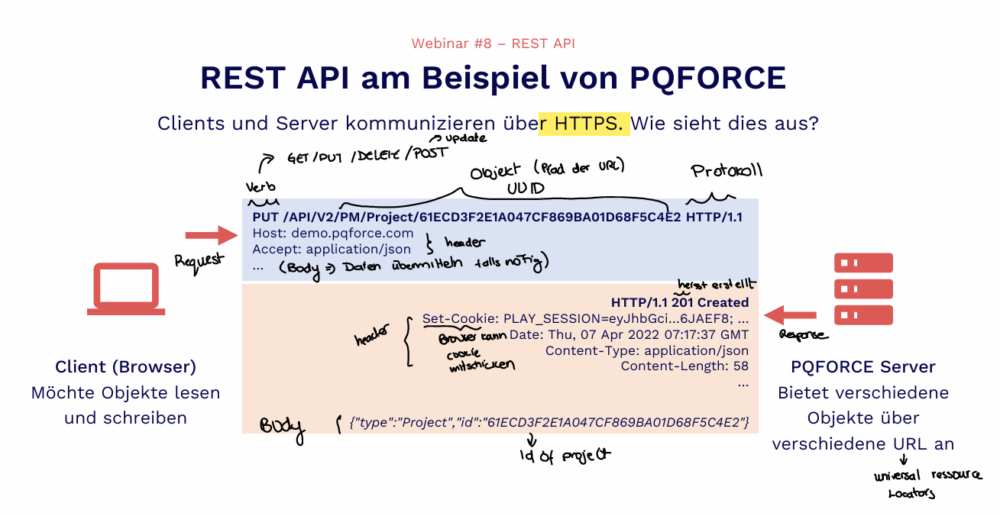

````markdown
# REST API Guide

## What is a REST API?

Representational State Transfer

### Application Programming Interface

- Official entry and exit for a software system
- PQForce interface with Browser

## Key Ideas Behind a REST API

1. **Uses HTTP Methods (Verbs)**  
   These tell the server what action you want:  
   - GET → retrieve data  
   - POST → create data  
   - PUT/PATCH → update data  
   - DELETE → remove data  

2. **Works with Resources (URLs)**  
   Everything is treated as a "resource":  
   - /users → list of users  
   - /users/1 → a specific user  

3. **Stateless**  
   Each request is independent. The server doesn't remember previous requests—you must include all needed info every time. (protocol is stateless)

4. **JSON**  
   Data is typically sent and received in JSON format → JavaScript Object Notation (easier to read than XML)

### Clients and Server Communication

Clients and Server communicate over HTTPS:  
Client → API → PQFORCE Server



### JSON Structure

- Has essentially two structural elements: Array (List) and Object (Key/Value pairs). These can be nested.

```json
Super-simple example:
{
  "type": "project",
  "id": "123",
  "tasks": [
    {"name": "Konzept", "time": 5},
    {"name": "Realisierung", "time": 8},
    {"name": "Einführung", "time": 6}
  ]
}
```

See also https://www.json.org (for more about JSON)  
→ The data in the body of PQFORCE requests and responses is always in JSON format.

## Questions

To check if you have access → https://websockettest.com/ but I get click allow no button shows?

Websockets function bidirectionally → so the server can also proactively tell the client something.

## Documentation

- General API documentation: https://community.pqforce.com/topic/55-how-does-the-api-work-in-general-can-i-have-an-intro/
- REST API documentation: https://portal.pqforce.com/en/downloads/ to get commands.

## Praxis

### GET Request on the Browser

1. Go to browser: demo.pqforce
2. Go to project: look at URL → https://demo.pqforce.com/change-factory?type=Project&id=18D9E5D430D649558D7C26424FF04DF5&partype=ProjectPortfolio&parid=9CE67199F02F4C99B034692D059F020A&feature=details has the project ID NOT THE API CALL
3. To get the JSON format (new tab) → https://demo.pqforce.com/API/V2/PM/Project/18D9E5D430D649558D7C26424FF04DF5 (project ID copied from URL)

You need to be logged in for this else you get an error.  
JSON Formatter for Microsoft Edge to format it and make it more readable.

You can read off a lot of things from the JSON file.

## UUIDs

- Are identifiers for data objects
- Every data object has a UUID (unique) (very very rare that they overlap in the whole world)
- Can be created independently of a central registration office or coordination between parties → i.e., a PQFORCE Client can thus create objects independently, i.e., without coordination with the server.
- The PQFORCE Server also offers an endpoint through which UUIDs can be generated: https://demo.pqforce.com/API/V2/CLF/Uuid/New/5 (i.e., if you are having trouble if the client doesn't know how to, when you open endpoint 5 UUIDs newly created)
- https://demo.pqforce.com/API/V2/PM/Projects For example to list all the projects
- Can be generated anywhere (browser, server, etc.)

## Using REST API from the Browser

On browser → GET requests, no PUT requests but in the background yes.

DEV tools (click Ctrl + F12) for some reason doesn't always work? If not use Ctrl + Shift + I (or three dots → more tools → developer tools)

→ Shows what happens backend (on network e.g. if you refresh)

## Evaluating JSON Data in Excel

An example in 4 steps: How many projects are there per portfolio?

1. Export all projects: https://demo.pqforce.com/API/V2/PM/Projects → copy raw data
2. Convert JSON data to CSV, e.g., with  
   **Caution:** https://www.convertcsv.com/json-to-csv.htm  
   : When using this tool, the data is uploaded to the internet! (a bit slow so click once and wait it doesn't show progress)
3. Load CSV in Excel  
   **Caution:** Consider encoding to display umlauts etc. correctly
4. Shape the data as a pivot table and visualize as a chart

## Loading Data Directly from Excel (Instead of Browser Using PQFORCE ComLibrary (.NET))

### Excel Client

Excel file that has macros that goes over a communication library with the PQForce server can communicate.  
You need the library and Excel and access to a PQForce server to communicate directly to the server from Excel.

## Automatic System-to-System Synchronization

- PQFORCE Agent runs as a Windows Service
  - Installed on a server or machine
  - Runs continuously in the background

- Data exchange happens automatically via:
  - APIs
    - REST or SOAP web services
    - Real-time or scheduled communication
  - File-based transfer
    - Formats: XML, JSON, CSV, IDoc
  - Files are picked up from or dropped into defined locations

- Communication flow
  - Agent ↔ External systems ↔ PQFORCE backend
  - Uses the REST API (HTTPS, port 443) shown in the diagram

- Automation features
  - Scheduled jobs (e.g., every hour/day)
  - Event-based triggers (e.g., new file detected)
  - No manual import/export needed

## Tokens

Using Insomnia to create a token.

A token is a piece of data (usually a long string) that:
- Identifies you (authentication)
- Defines what you're allowed to do (authorization)

Example:  
eyJhbGciOiJIUzI1NiIsInR5cCI6IkpXVCJ9...

### How Tokens Are Used

1. You log in with username/password
2. Server verifies you
3. Server gives you a token
4. You send the token with every request

Instead of having to enter a password each time, it's like you have a wristband → you don't need to show your ID.

## JWT (JSON Web Token)

Contains:
- Header → how it's signed
- Payload → your data (user ID, role, etc.)
- Signature → ensures it wasn't tampered with

## API Server Internals

- With JavaScript automations, customer-specific logics can be implemented.
- The entire API is also available in JavaScript.

Example: Updating a project.  
REST API:  
PUT /API/V2/PM/Project/61ECD3F2E1A047CF869BA01D68F5C4E2

The project data is passed in the request body as JSON.

JavaScript:  
Pqf.pm.putProject('61ECD3F2E1A047CF869BA01D68F5C4E2', projectObj)  
The project data is passed as JSON in the variable projectObj.
````

